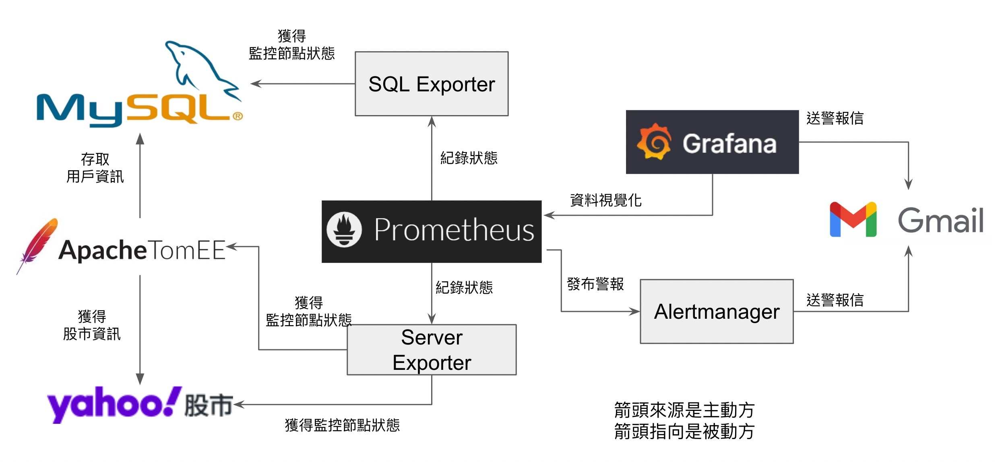
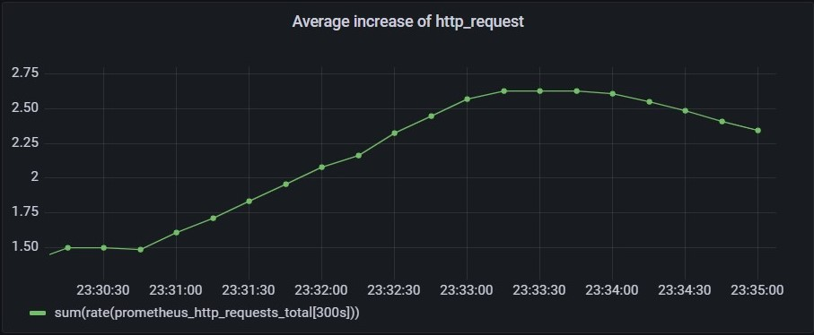
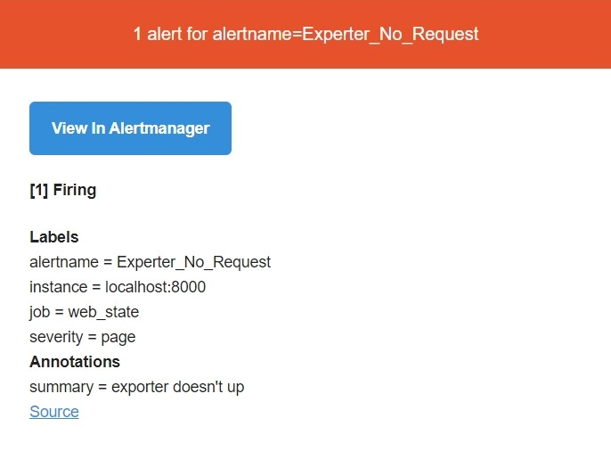
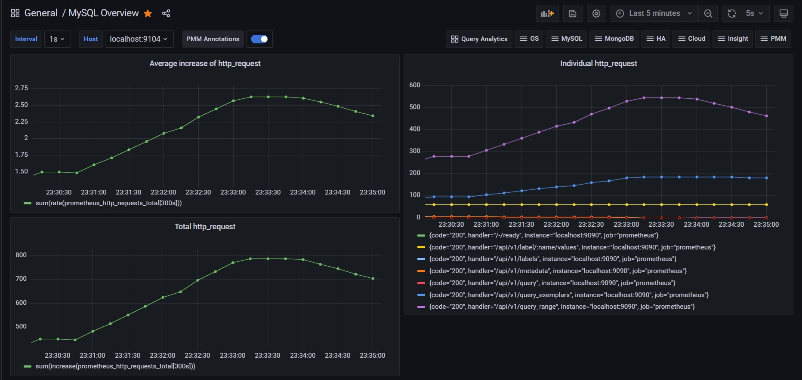

# 第八組 Prometheus

## Outline
  - [基本架構圖](#基本架構圖)
  - [功能性和非功能性](#功能性和非功能性)
  - [節點功能](#節點功能)
  - [操作步驟](#操作步驟)
  - [影片、PPT連結 ](#影片ppt連結-)
  - [Grafana Graph for MySQL](#Grafana-Graph-for-MySQL)
  - [補充](#補充)

## 基本架構圖

## 功能性和非功能性

### 功能性

Prometheus的功能是做**系統偵測**的部分，由於有使用Grafana做視覺化

所以會獲得如以下的圖

如果出現錯誤，會發出Alert，來利用Alertmanager寄信，如圖

### 非功能性
#### 5分鐘內prometheus可處理的資料量

分別是http_request 平均增長率(左上)，http_request 總數(左下)，個別 http_request 數(右)

左下圖，取最後一分鐘(23:34~23:35)估算 => 750*3 + 700 = 2950 http_request/min，一分鐘能處理 2950 個 http 請求

## 節點功能

### Prometheus

Prometheus節點做為整個系統的中樞，主要是使用時間序列資料庫存取各監控節點的資料，再將資料格式化成外部運用的型態。

### SQL Exporter

SQL Exporter為 Prometheus團隊開發出來的獨立Library，可以透過監控選定的資料庫，並將資料轉換成Prometheus主機可以使用的資料型態，其優點為支援線上所有主流資料庫，這裡使用MySQL。

### Server Exporter

Server Exporter為本組設計用來監控網頁是否運作正常的工具，撰寫語言為Python，透過此工具，可以知道監控節點的狀態，我們使用它監控ApacheTomEE以及Yahoo股市網頁。

### MySQL

是一個開放原始碼的關聯式資料庫管理系統，MySQL在過去由於效能高、成本低、可靠性好，已經成為最流行的開源資料庫，因此被廣泛地應用在Internet上的中小型網站中。隨著MySQL的不斷成熟，它也逐漸用於更多大規模網站和應用，比如維基百科、Google和Facebook等網站。

### Yahoo! 股市

Yahoo!奇摩股市提供您當日行情、大盤走勢、類股走勢、期貨及選擇權分類報價、港滬深股、美股、財經新聞等資訊。

### ApacheTomEE

TomEE是JavaEE的伺服器，是由Tomcat演化而來，並融合JavaEE的特性，如EJB、CDI、JPS、JSF等，由於其良好的嵌入性質及小巧的內存空間，使其也適合在cloud-native的環境中執行

### Grafana

Grafana為Prometheus官方推薦使用的資料視覺化軟體，提供線上以及本機使用，其特點為支援非常廣大的資料型態和提供目前所有主流的資料流框架，而客製化的圖表選項以及豐富的社群支援也是讓Grafana如虎添翼。
Prometheus主機提供給Grafana所需要的資料，而Grafana在進行監控的同時，可以依據數據的變化以及可客製化的閥值選項進行預警。

### AlertManager

AlertManager為Prometheus團隊開發出來作為支持原生Prometheus主機的預警系統，特點為不需要刻意透過其他的第三方程式，透過資料的檢閱以及偵測即可以發出預警，原生的好處為相容性高。

### Gmail

Gmail是我們這次使用的預警出口，AlertManager以及Grafana的預警系統都會在我們設定的監控閥值下送出信件警告使用者。

## 操作步驟

### [Server_Exporter](server%20exporter/README.md)

### [Web States Alert](Server監控/README.md)

### [MySQL & MySQL_Exporter & Grafana](https://docs.google.com/document/d/1xd6boe9BuJ7gB__l12_fa_s02MIc0rkNlu8X-ZMbxik/edit)

## 影片、PPT連結 

### [影片](https://www.youtube.com/watch?v=E7UG9j0qzro)

### [PPT](https://docs.google.com/presentation/d/1tQe05gncTl-CJvk5dt6QzU1edvb3t6xSlCecpbbTogA/edit?usp=sharing)

## Grafana Graph for MySQL

| 指標 | 名稱 | 說明 
|------|------|-----|
| MySQL Status | MySQL 狀態 | UP or DOWN |
| MySQL Uptime | 運行時長 | MySQL服務器自從上次重啟運行到現在的時長 |
| Current QPS | 每秒查詢速率 | 根據使用MySQL的SHOW STATUS命令查詢到的結果.它是服務器在晟後一秒內執行的語句數星，這個變量包含在存儲程式中執行的語句.與Questions變量不同 |
| InnoDB Buffer Pool Size | InnoDB Buffer 快取池 | MySQL服務器自從上次重啟運行到現在的時長 |
| MySQL Status Graph | MySQL 狀態圖 | for Alert |
| MySQL Connections | MySQL 連接數 | MySQL 服務器自從上次重啟運行到現在的最大連接數 |
| MySQL Client Thread Activity | Client Thread 數量 | 未休眠的 Thread 數量 |
| MySQL Questions | Server 執行的語句 | 與 QPS 不同，這裡只包括 Client 到 Server 的 Question，不包含 Storage process 的 Question |
| MySQL Thread Cache | Thread 快取 | Clinet 斷線時，快取未滿，則 Client 的 Thread 會被放入快取 |
| MySQL Temporary Objects | MySQL 的 Temporary Table | 加速查詢用 |
| MySQL Select Types | 未使用 index 查詢的 counter | 有多少查詢導致了全部 table 都要掃描 |
| MySQL Aborted Connections | 終止的連接數 | 主機在連接中被中斷時，MySQL 會將其資料保存在系統表中 |
| MySQL Table Locks | 使用 Lock 的數量 | MySQL 會因為各種原因需要用到 Lock |
| MySQL NetWork Traffic | 網路流量 | InBound 是收到的網路流量 |
| MySQL Network Usage Hourly | 網路使用量/小時 | -- |
| MySQL Internal Memory Overview | 內存概覽 | -- |
| Top Command Counters | 每個 xxx 語句已執行的次數 | 每種類型的語句都有一個狀態變量, e.g. Com_delete 和 Com_update 計數 |
| Top Command Counters Hourly | 每小時最高命令計數器 | -- |
| MySQL Handlers | 關於 MySQL 如何選擇、更新、插入和修改行、表和索引的內部統計 | 當服務器執行全表掃描時，`read_rnd_next` 會增加；當使用索引完成讀取時，`read_key` 會增加；當存儲引擎讀取下一個索引條目時，`read_next` 會增加。高值意味著正在執行大量索引掃描。|
| MySQL Query Cache Memory | 只有一個線程可以同時在查詢緩存中進行操作。這種序列化不僅適用於 SELECT，也適用於 INSERT/UPDATE/DELETE | `query_cache_size` 設置的越大，這些操作就越慢 |
| MySQL Slow Queries | 比 long_query_time 設置慢的查詢 | -- |
| MySQL File Openings | 當前打開 file 的計數器 | -- |
| MySQL Open Files | 自上次重新啟動 MySQL 以來打開 file 的計數器 | -- |
| MySQL Table Open Cache Status | 打開 Table 的快取狀態 | -- |
| MySQL Open Tables | 打開 Table 的數量 | -- |
| MySQL Table Definition Cache | 所有 Table 快取 | -- |

## 補充
### 資料庫程式碼位於 CustomerInfo/src/main 的 java/com/example/customerinfo 及 webapp 下
