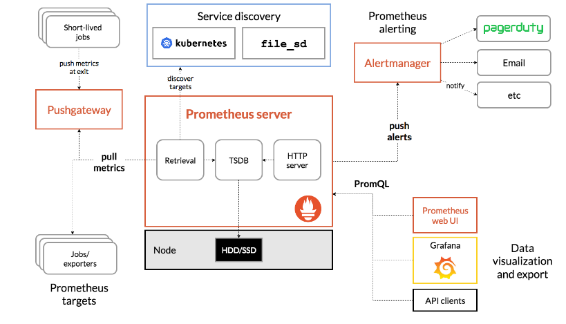

[Promethous 各層分析](https://www.twblogs.net/a/5cbf93cfbd9eee3aed785676)

### Prometheus 的 Server 用於取得和存儲時序數據至 TSDB，其整體是藉由 pull-based 的設計，該設計不是由Client 將數據提供給 Server，而通常是使用 GET 獲取Target 位置，讓服務去取得相應的指標後進行採集並交由Server

### Retrieval 是收集資料的元件，架設 Prometheus 的時候會從設定的 Pushgateway 或者 Exporter 抓取指標

### HTTP server => 提供對外的 http 服務

### TSDB => 儲存資料庫或查詢

[Prometheus – GITHUB documentation](https://github.com/prometheus/prometheus/blob/main/documentation/internal_architecture.md)

  

[Prometheus - scrape(含Sequence Graph)](https://qiankunli.github.io/2020/06/25/prometheus_source.html)

似乎 scrape 是靜態？

[Prometheus – 啟動分析](https://blog.csdn.net/dengxiafubi/article/details/102845639?ops_request_misc=%257B%2522request%255Fid%2522%253A%2522159416824319724811829463%2522%252C%2522scm%2522%253A%252220140713.130102334.pc%255Fall.%2522%257D&request_id=159416824319724811829463&biz_id=0&utm_medium=distribute.pc_search_result.none-task-blog-2~all~first_rank_ecpm_v3~rank_business_v1-12-102845639.ecpm_v3_rank_business_v1&utm_term=prometheus%E6%BA%90%E7%A0%81)

[Prometheus - 指標採集(1)](http://ldaysjun.com/2019/11/13/Prometheus/1/)

[Prometheus – 指標採集(2)](https://blog.csdn.net/dengxiafubi/article/details/102996336)

[Prometheus – 指標快取](https://blog.csdn.net/dengxiafubi/article/details/103209301)

[Prometheus - TSDB(offical docs)](https://github.com/prometheus/prometheus/tree/main/tsdb/docs)

[Prometheus - TSDB理論(1)](https://liqiang.io/post/writing-a-time-series-database-from-scratch-040e5f23)

[Prometheus - TSDB理論(2)](https://blog.csdn.net/weixin_43257196/article/details/121199732)

[Prometheus - TSDB理論(3)](https://www.gushiciku.cn/pl/gsAR/zh-tw)

[Prometheus - TSDB解析](https://iter01.com/13061.html)

[Prometheus – 配置動態管理](https://blog.csdn.net/qq_25934401/article/details/82118008?ops_request_misc=%257B%2522request%255Fid%2522%253A%2522164836586316782094865725%2522%252C%2522scm%2522%253A%252220140713.130102334..%2522%257D&request_id=164836586316782094865725&biz_id=0&utm_medium=distribute.pc_search_result.none-task-blog-2~all~baidu_landing_v2~default-1-82118008.142%5ev5%5epc_search_insert_es_download,143%5ev6%5eregister&utm_term=Prometheus+%E5%8A%A8%E6%80%81)

[Prometheus – 其它](https://so.csdn.net/so/search?q=Prometheus%E6%BA%90%E7%A0%81%E5%AD%A6%E4%B9%A0&t=blog&u=qq_35753140)

